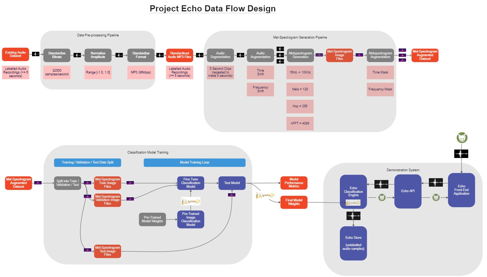

## Bioacoustics-Classification-Tool

### Capstone Project (A) - Bioacoustics Classification Tool

#### Architectural design

Source for diagram was created using MIRO tool here (password: projectecho): https://miro.com/app/board/uXjVPBXmVOA=/

 

#### Data Pre-Processing Pipeline 

The pre-processing pipeline converts audio files into a consistent format ready for processing by the mel-spectrogram pipeline.

#### Mel-Spectrogram Generation Pipeline

The mel-spectrogram pipeline generates spectrogram images from each audio sample by splitting into small audio clips of equal size and also generating augumentations - such as frequency shifting the audio signal.  

#### Classificaton Model Training

The model training uses pre-computed spectrogram images which have been split into training, test and validation subsets.  The initial protoype

#### Project Echo Components

##### Prototype Engine

The prototype classification engine will demostrate that it is possible to process data from raw labelled sound clips to animals species results.  This prototype engine will be in the form of a series of Jupyter notebook files which must be manually run in sequence (to drive the data pipeline)  It is expected that these prototype notebook files will provid an environment that allows data scientists to further develop and refine models to increase classification performance.

##### Echo Engine

The Echo Engine component takes requests from an API in the form of sound clip, executes the classification model and returns the classification result back to the API to distribute to Echo HMI end points.  The classicication model will be trained offline and deployed into the Echo Engine once the performance of the model is validated.

##### Echo API

The Echo API provides a secure end point service for remote applications to process sound clips and return classification results.  The Echo API uses the Echo Engine to do the processing in its behalf.  The API also forwards data to the Echo Store which will persist the sound clips for further subsequent research.

##### Echo HMI (Human Machine Interface)

The Echo HMI provides a front end user experience (UX) for capturing sound clips of animals and allow them to be uploaded to the Echo API service.  The HMI allows interactive interaction with the system.  In the long run, it is expected that the majority of data requests to the Echo API Service will originate from a suite of remote sensors in the field (e.g. across the Otways region).

##### Echo Store

The Echo Store is a modern database solution for storing raw audio files as requested via the Echo API Service.  This store acts a record of the sound sample requests and provides an opportunity for researchers to later label these records and further fine tune the quality of the species classification model.