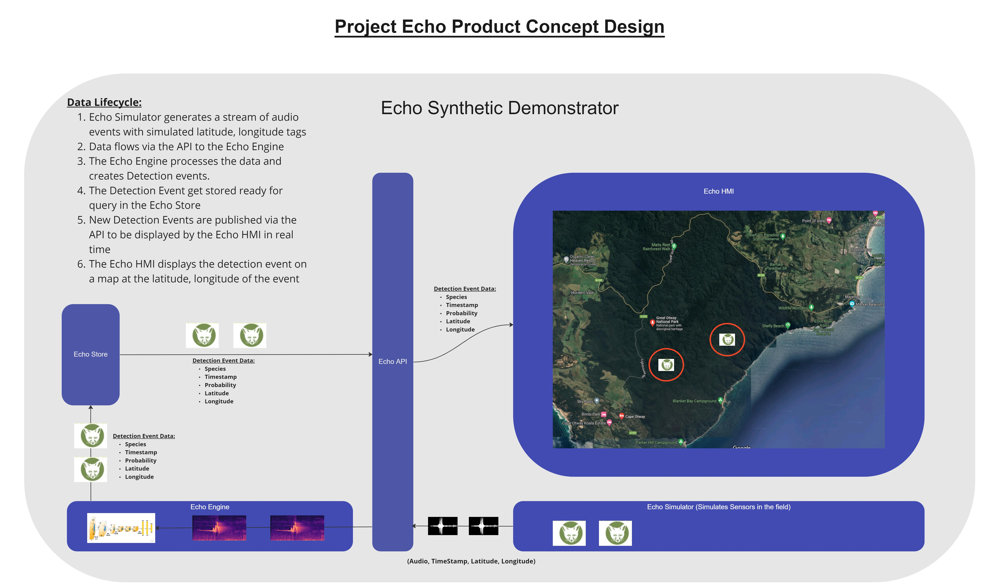

## Bioacoustics-Classification-Tool

### Capstone Project (A) - Bioacoustics Classification Tool

#### Architectural design

This architectural design is intended to elicit the system components and provide an initial view of the data processing and model training pipelines.  It is expected that during implementation, this design will be evolved iteratively as we learn more about how audio processing is performed.

The basis of this material was derived from the initial literature review material captured in this repository.  There are essentially two approaches that appear to proliferate the research in this space.  The first approach involves processing the audio waveform directly and translating that into a classification result.  The 2nd approach involves first converting the audio into image domain (via something called a Mel-Spectrogram) and them perform classification on the images using the well established image classification paridigm.  The 2nd approach that leverages mel-spectrogram intermediate images has been adopted for the Echo Prototype investigation for 2022-T3.

A diagram of the data flows and major system components identified so far is contained in the  diagram below.  To assist in the interative approach to design, the diagram link is provided to an editable online diagramming tool called 'miro'.  To edit this diagram follow the link provided here using the  password 'projectecho'. https://miro.com/app/board/uXjVPBXmVOA=/

 

Note: If any updates are made in miro, these will need to be manually exported as an image file and uploaded to github to keep this design material up to date.

#### Data Pre-Processing Pipeline 

The pre-processing pipeline converts audio files into a consistent format ready for processing by the mel-spectrogram pipeline.  In order to ensure that each audio file is treated in a consistent way, audio files will need to be converted to a consistent bitrate, normalised and converted to the same format.  In addition, the pipeline cuts the audio file into 5 second slices which will result in an assocaited mel-spectram for each slice.  All the parameters mentioned on the design diagram above a hyper-parameters of the system that will ultimately need to be tuned end-to-end to ensure compatiblity with the image classification modeling inputs (e.g. changing the HOP parameter will change with width of the resulting spectrogram image).  The initial set of hyperparamters were derived from the Exploratory Data Analysis (EDA) as captured in this repository.

#### Mel-Spectrogram Generation Pipeline

The mel-spectrogram pipeline generates spectrogram images from each audio sample by splitting into small audio clips of equal size and also generating augumentations - such as frequency shifting the audio signal.  The literature indicates that model generalisation performance can be improved through augmenting the audio input samples.  Augmentation can be performed directly on the audio amplitude signal and/or the generated mel-spectrogram images.  One type of augmentation masks some part of the time or frequency space of the spectrogram image randomly so the model doesn't learn any biases towards specific image artefacts in certain frequency bands - e.g. learning to classify animals on the basis of how much background noise is in the audio signal rather than the structure of the animal sound.

#### Classificaton Model Training

The model training uses pre-computed spectrogram images which have been split into training, test and validation subsets.   Pre-computation of the spectrograms is required as the process of performing fast fourier transforms to derive the energy at each frequency band is a relatively expensive and slow computational task.  Since a large number of input samples are likely, it is not possible to leverage caching in the input pipeline.  The initial protoype will leverage pre-trained image classification models to perform the down-stream classification task.  This classification will be a multi-class classification task that will provide a probability distribution across the known species the model is trained on.  

Care must be taken in the implementation to ensure that augmentation is only applied to the training data set.  If augmented files are included in the validation or test set then data leakage is likely to occur and the metrics will not be valid (as augmented signals are not real world samples).

#### Product Concept Design

The following diagram shows the product concept design the project aims to achieve longer term.  This design view below provides an overview of a proposed collection of components that interact to simulate the detection of animals via a network of sensors.  The Echo Simulator provides a way to generate random sound events (with associated location metadata) for the engine to process. In this way, the simulator is simulating the real world audio sensor array. Simulated Sensor data is translated into 'Detection Events' which are stored in the Echo Store ready for the HMI client to connect and visualise.  

When a new Detection Event is added into the system, the API pushes these events to the client so that detections can be visualised in real time.  In addition to the animal classification result, probability information is provided.  This probably information can be integrated and combined by the HMI to form a 'heatmap' of animal sounds per species.  

 

#### Project Echo Components

The following sub-sections describe each of the major components of the Project Echo system.  These components.  The Project Echo team members will contribute across these components (as a matrix organisation) to apply their skills in cross dispine virtual teams.

##### Echo Prototype

Echo Prototype is a prototype classification engine and data processing pipeline will demostrate that it is possible to process data from raw labelled sound clips through to classification of animals species.  This prototype engine will be in the form of a series of Jupyter notebook files which must be manually run in sequence (to drive the data pipeline)  It is expected that these prototype notebook files will provide an environment that allows data scientists to further develop and refine models to increase classification performance into the future.

##### Echo Engine

The Echo Engine component takes requests from an API in the form of sound clip, executes the classification model and returns the classification result back to the API to distribute to Echo HMI end points.  The classicication model will be trained offline and deployed into the Echo Engine once the performance of the model is validated.

##### Echo API

The Echo API provides a secure end point service for remote applications to process sound clips and return classification results.  The Echo API uses the Echo Engine to do the processing in its behalf.  The API also forwards data to the Echo Store which will persist the sound clips for further subsequent research.

##### Echo HMI (Human Machine Interface)

The Echo HMI provides a front end user experience (UX) for capturing sound clips of animals and allow them to be uploaded to the Echo API service.  The HMI allows interactive interaction with the system.  In the long run, it is expected that the majority of data requests to the Echo API Service will originate from a suite of remote sensors in the field (e.g. across the Otways region).

##### Echo Store

The Echo Store is a modern database solution for storing raw audio files as requested via the Echo API Service.  This store acts a record of the sound sample requests and provides an opportunity for researchers to later label these records and further fine tune the quality of the species classification model.

##### Echo Simulator

The Echo simulator