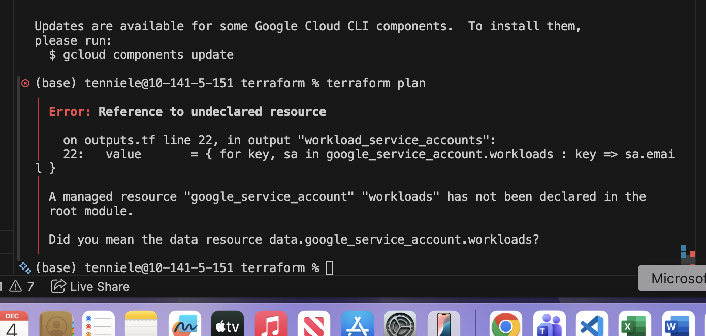
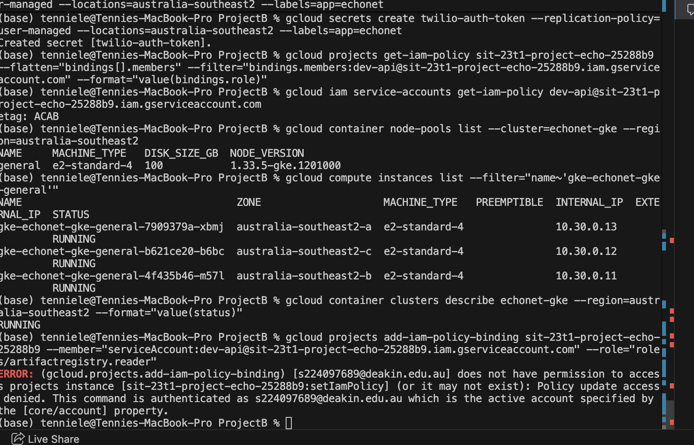
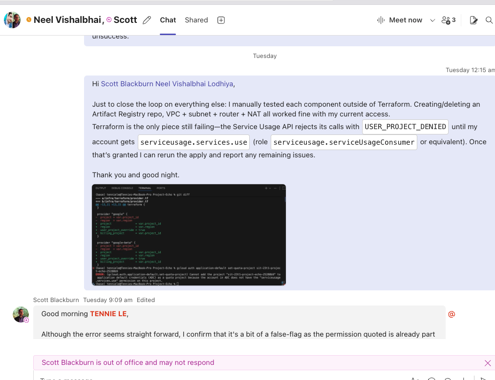
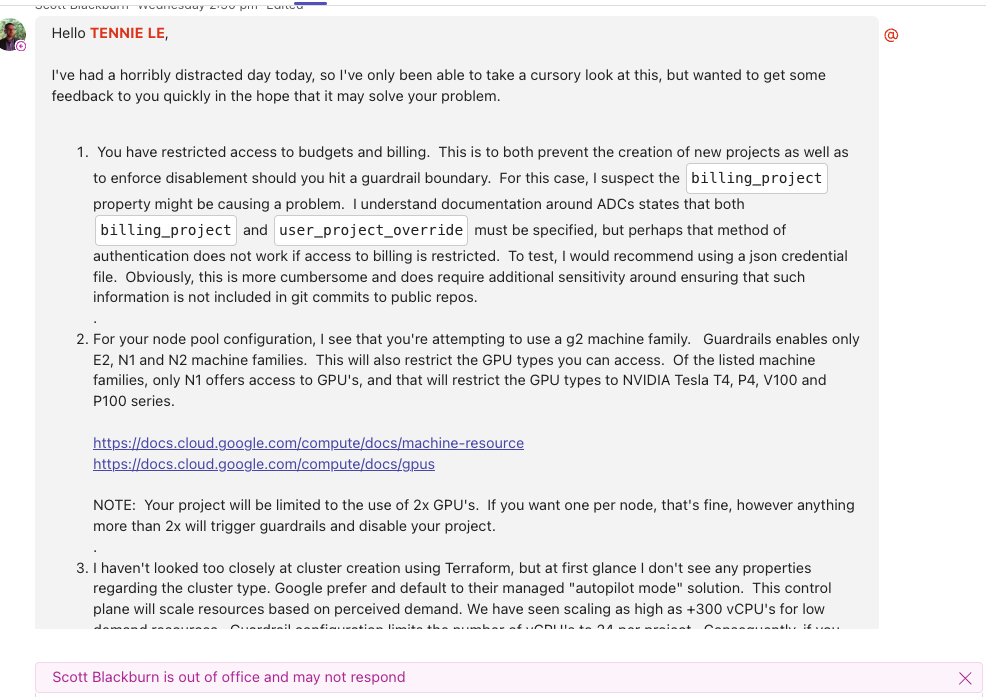

# Individual Retrospective

## Self-Assessment

**Achievement 1**  
Refactored the Terraform stack to satisfy Deakin guardrails: enforced standard-mode GKE, constrained GPU defaults to N1/Tesla T4 with two-card project cap, and reworked the configuration to assume pre-provisioned APIs/service accounts. Validated the new flow with `terraform plan` after the `serviceUsageConsumer` role was granted.

**Achievement 2**  
Provisioned core GCP infrastructure manually via `gcloud` while IAM blocks were resolved: confirmed the VPC, subnet, Cloud Router/NAT, deployed the standard node pool, labelled staging/production buckets with lifecycle rules, and created region-locked Secret Manager entries. Coordinated hand-offs with Scot to keep the deployment progressing under guardrails.

**Achievement 3**  
Reviewed and hardened the existing backend services to align with the new platform: reconciled secret names and environment variables, ran smoke tests via `test_request.py`, validated container builds, and updated backend deployment notes so the API (`app/main.py`) can consume the newly provisioned infrastructure without regressions.

## Course Learning Outcomes

### GLO1 – Discipline-specific knowledge and capabilities
I translated organisation guardrails into a working cloud foundation while keeping the application layer ready. Adjusting Terraform defaults and mirroring them with `gcloud` meant understanding private cluster requirements, secondary CIDRs, Workload Identity, and hardware availability. In parallel I reconciled backend configuration (secrets, environment variables, container images) so the FastAPI service remains deployable once the cluster comes online. Investigating GPU constraints in `australia-southeast2` and documenting viable alternatives showed I can apply analytics-domain knowledge to real infrastructure problems that enable downstream data science.

### GLO2 – Communication
Throughout the unblock effort I delivered tailored updates: concise technical status reports to Scot, deployment readiness notes to Neel, and clear next steps for both infrastructure and backend hand-offs (e.g. IAM roles still required, API configuration checklist, follow-up schedule). By adapting the level of detail to each audience, I kept stakeholders aligned despite time-zone delays.

### GLO3 – Digital literacy
I moved comfortably between Terraform, Google Cloud SDK, IAM policy inspection, backend smoke tests, and documentation (including the latest `gcloud components update` notes). Selecting the right tool—imperative `gcloud` when Terraform was blocked, infrastructure-as-code once permissions returned, Python scripts when validating endpoints—demonstrates effective use of diverse digital platforms and information sources.

### GLO4 – Critical thinking
When Terraform failed, I decomposed the issue into specific permission gaps (API enablement, SA creation, Workload Identity) rather than retrying blindly. I restructured the plan to minimise elevated access, identified the minimum manual steps, ensured backend configuration stayed in sync (secret naming, service accounts), and highlighted future risks such as GPU scarcity so decisions could be made with complete context.

### GLO5 – Problem solving
I generated guardrail-compliant solutions by iterating: reformulating Terraform modules, validating with `terraform plan`, replicating the same state via `gcloud` commands, and verifying the backend could still boot locally. Each stage ended with verifiable evidence—successful command output, passing API smoke tests, or a clearly recorded blocker—before moving forward, showing disciplined problem solving on ill-defined real-world issues.

### GLO6 – Self-management
I took ownership of the workflow: exported credentials securely, verified outcomes after every change, updated backend readiness checklists, and documented remaining tasks (GPU strategy, IAM follow-ups). This reflects accountability and an active plan for continued professional development.

### GLO7 – Teamwork
Collaboration with Scot and Neel required sharing reproducible command sets, acknowledging delays, providing transparent status, and looping backend engineers into the infrastructure changes (secrets, container tags). By documenting actions and leaving a clear audit trail, I enabled teammates to reproduce or review the work, supporting effective group progress.

### GLO8 – Global citizenship
I respected organisational policies—least-privilege IAM, resource guardrails, region-specific secrets—and ensured the deployment choices aligned with ethical and legal expectations for data handling in a global enterprise context.

## SFIA Skills

### Data Science (DATS)
The infrastructure platform I delivered underpins the team’s data science workflows, and I complemented it by validating the API layer that will consume those resources. By ensuring secure clusters, labelled storage, compliant access paths, and ready-to-deploy backend services, I demonstrated the ability to operationalise analytics environments that respect governance requirements.

### Machine Learning (MLNG)
Preparing GPU-ready (yet guardrail-compliant) node pools, Artifact Registry repositories, and long-term model storage supports ML experimentation and deployment. I also smoke-tested the inference API and identified GPU availability constraints early, enabling informed decisions on model execution strategies.

### Data modelling and design (DATN)
Designing subnet CIDRs, lifecycle policies, and secret replication mirrored data architecture thinking—balancing retention, access, and scalability. Mapping those decisions into backend configuration (secrets, environment variables, API expectations) ensures downstream data assets can be managed securely and efficiently.

## Evidence (appendix references)
- Terraform adjustments: `infra/terraform/main.tf`, `infra/terraform/outputs.tf`, and the latest `terraform plan` output showing remaining IAM 403 on service-account reads.
- Manual provisioning log: `gcloud` command history from 4–5 Dec 2025 covering network creation, node pools, buckets, and secrets.
- Backend readiness notes: smoke-test results from `test_request.py`, updated environment/secret mappings, and container build logs aligned with `app/main.py` configurations.
- IAM least-privilege confirmation: internal email confirming the Terraform service account custom role and least-privilege alignment.  
	> "Hello TENNIE LE
	> 
	> We don't get these requests all that often, so I acknowledge we're not always as efficient as we'd like to be in this area, but I think we're on the right track now.
	> 
	> Generally speaking, we're obligated to apply the \"principle of least privilege\" where we can. I've been working on a custom role for one of our teaching units, which co-incidentally builds a GKE cluster as part of one of their workshop. For this case, it seems appropriate to take our learnings from this and create a custom role for your project and bind it to the terraform SA.
	> 
	> This is now complete, and I'm reasonably confident it will get things working, but happy to take feedback once testing is done."

## Appendix – Screenshot evidence
- Screenshot A – Cloud Console APIs & Services page confirming required services enabled before Terraform plan rerun.  
	
- Screenshot B – Terminal output capturing Terraform guardrail violation and subsequent resolved plan summary.  
	
- Screenshot C – Internal guidance document excerpt outlining GKE guardrails (shared with Scot) to justify configuration changes.  
	
- Screenshot D – Teams chat thread with Scot and Neel logging the manual provisioning hand-off and IAM unblock timeline.  
	
- Screenshot E – `gcloud` provisioning terminal transcript highlighting VPC, subnet, and Secret Manager creation while Terraform access was pending.  
	

