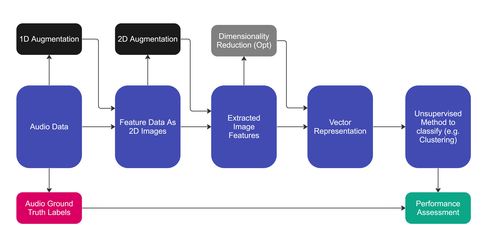

## Notes of unsupervised classification methods

This research note is about capturing the techniques that may be applicable to performing unsupervised learning and classification tasks on audio data.  For simplicity, the process of generating the initial 2D image representation of a 5 second audio clip is left out (although combinations of different audio representation techiques such as mel-specs, mfccs and discrete wavelet transforms) would have an impact on performance.

Unsupervised image classification techniques are a subset of machine learning methods that aim to identify and categorize patterns within images without relying on pre-labeled data. These approaches are particularly useful for cases where labeled data is scarce, expensive to generate, or when the goal is to uncover unknown structures within the data. The performance of these methods can be evaluated using ground truth labelled data.

To help speed up generation of these notes, GPT-4 was used to assist writing summary descriptions of algorithms found in literature.

### Feature Extraction Methods

#### Autoencoder

Autoencoders are a type of neural network that learns to encode and decode images in an unsupervised manner. The encoder compresses the input image into a lower-dimensional latent space, while the decoder reconstructs the image from the latent space. By training the autoencoder to minimize the reconstruction error, it learns to capture essential features from the images, effectively performing dimensionality reduction. The lower-dimensional representations can then be used for clustering or other unsupervised classification tasks.

Idea: We could use a combination of supervised feature extraction method combined with unsupervised clustering methods: 

First build an auto-encoded that is trained in a supervised way to create a vector representation of 2 image inputs known to be of different classes, with a combined loss function that uses a combination of losses:

- reconstruction error: in being able to reconstruct the two original feature images
- classification error: in being able to only represent latent space features that reduce classification error

#### Histogram of Oriented Gradients (HOG)

HOG captures the distribution of gradient directions in an image. It divides the image into small cells, calculates the gradient magnitude and orientation for each pixel, and creates a histogram of gradient orientations for each cell. The histograms from all cells are concatenated to form the final feature vector. HOG is particularly useful for object detection and recognition tasks.

Wiki Reference: https://en.wikipedia.org/wiki/Histogram_of_oriented_gradients

#### Scale-Invariant Feature Transform (SIFT)

SIFT is a robust local feature descriptor that is invariant to scale, rotation, and illumination changes. SIFT identifies keypoints in the image, calculates their scale and orientation, and generates a 128-dimensional descriptor for each keypoint based on the local gradient information. These descriptors can be used as feature vectors for various tasks.

Wiki Reference: https://en.wikipedia.org/wiki/Scale-invariant_feature_transform

#### Speeded-Up Robust Features (SURF)

SURF is a faster and more efficient alternative to SIFT that is also invariant to scale, rotation, and illumination changes. SURF uses integral images for fast computation and approximates the Laplacian of Gaussian with box filters to detect keypoints. It computes Haar wavelet responses in the neighborhood of each keypoint to create a descriptor. The SURF descriptors can be used as feature vectors for various applications.

Wiki Reference: https://en.wikipedia.org/wiki/Scale-invariant_feature_transform

#### Deep Learning-based Features

Convolutional Neural Networks (CNNs) have proven to be powerful tools for image feature extraction. By training a CNN on a large dataset, the network learns hierarchical feature representations that can be used as feature vectors. You can use pre-trained models like VGG, ResNet, or Inception and extract features from the intermediate layers (e.g., fully connected layers or last convolutional layers) to generate a vector representation of the image.

### Dimension Reduction Algorithms

In order to improve the performance of downstream clustering methods, the application of dimensionality reduction techniques are typically applied.  These techniques reduce the dimensionality of the extracted features and generally improve the robustness and performance of the classfication algorithms.

#### Principal Component Analysis (PCA)

PCA is a widely used linear dimensionality reduction technique that seeks to project the original data into a lower-dimensional subspace while preserving the maximum variance. PCA computes eigenvectors and eigenvalues of the data covariance matrix and selects the top principal components as the new basis for the lower-dimensional space. In unsupervised image classification, PCA can help reveal the underlying structure of the data and improve clustering performance by reducing noise and redundancy.

### t-Distributed Stochastic Neighbor Embedding (t-SNE)

t-SNE is a non-linear dimensionality reduction technique that focuses on preserving local neighborhood relationships in the lower-dimensional space. It minimizes the divergence between probability distributions that represent pairwise similarities in the original and reduced spaces. t-SNE is particularly useful for visualizing high-dimensional image data and can aid in understanding the structure and relationships between different classes or clusters.

### Clustering-Based Methods

#### K-Means Clustering

K-means is an unsupervised clustering algorithm that partitions a set of images into K distinct groups, where each image belongs to the cluster with the nearest mean. The algorithm iteratively updates the centroids of the clusters and assigns images to the closest centroid until convergence. K-means is simple to implement, but the choice of K and initial centroids can significantly impact the results.

#### Hierarchical Clustering

Hierarchical clustering builds a tree-like structure to represent the relationships between images. The algorithm starts by treating each image as a separate cluster and iteratively merges the closest clusters until all images belong to a single cluster. Hierarchical clustering can use different distance metrics and linkage criteria to determine the similarity between clusters, which can influence the structure of the resulting dendrogram.

