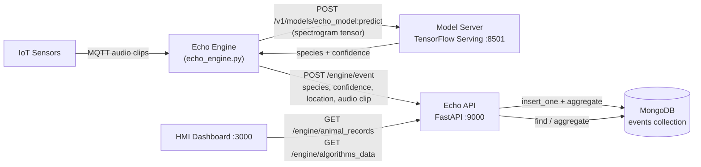

# Backend Dependency Map

**Task:** B2.2 — Backend Dependency Map
**Scope:** How the API (`echo_api`, `src/production/backend`) interacts with the **Engine** and **MongoDB**. The full list of every mounted route (regardless of dependency) is covered separately by B2.1.

This document describes the system **as it exists on `main`** — no code was changed to produce it.

---

## 1. Core flow: Engine → API → MongoDB

**Reading this diagram:** the Engine is the only thing that *writes* detection data into the API. Everything else (HMI, admin tools) only *reads* it back out through the API — nothing talks to MongoDB directly except the API itself.

### Endpoint-by-endpoint

| Direction | Method & Path | Caller | Mongo collection touched | Source |
|---|---|---|---|---|
| Engine → API | `POST /engine/event` | `echo_engine.py` | `events` (insert) | [engine.py:17-25](../../src/production/backend/app/routers/engine.py), called from [echo_engine.py:508-509](../../src/production/engine/echo_engine.py) |
| API → HMI | `GET /engine/animal_records` | HMI / any client | `species` (aggregate, joined with `events`) | [engine.py:30-78](../../src/production/backend/app/routers/engine.py) |
| API → HMI | `GET /engine/algorithms_data` | HMI (also called *by the API's own HMI router*, see note below) | none — static dict | [engine.py:81-85](../../src/production/backend/app/routers/engine.py) |
| Engine → Model Server | `POST .../echo_model:predict` | `echo_engine.py` | n/a (not MongoDB) | [echo_engine.py:366](../../src/production/engine/echo_engine.py), [echo_engine.py:508](../../src/production/engine/echo_engine.py); config value confirmed in `echo_engine.json:39` |

**Engine side confirmed, not assumed:** `echo_engine.py:508` builds the URL `http://ts-api-cont:9000/engine/event` and posts a `detection_event` dict — and the field names in that dict (`sensorId`, `microphoneLLA`, `animalEstLLA`, `animalTrueLLA`, `animalLLAUncertainty`, `audioClip`, `sampleRate`) match exactly what `EventSchema` requires on the API side. This is a verified, working contract between the two services.

---

## 2. Finding worth flagging: `events` vs. `detections`

The task guide's example curl command posts to `/engine/event` and describes the data landing in a "detections" collection. In this codebase, that's not quite accurate, and it's worth documenting precisely:

- The **real, currently-wired** Engine → API path writes to the **`events`** collection ([database.py:18](../../src/production/backend/app/database.py), written by [engine.py:20](../../src/production/backend/app/routers/engine.py)).
- There is a **separate** `detections` collection ([database.py:79](../../src/production/backend/app/database.py)) with its own full CRUD API at `/detections` ([routers/detections.py](../../src/production/backend/app/routers/detections.py)). Nothing in the Engine's real pipeline writes to it. It's a parallel, newer surface (comment in `database.py` marks it `# Update Database Setup (t2.2025)`) that isn't yet connected to live Engine traffic.

Unifying or migrating this is a scope decision for whoever owns the schema, not part of this documentation task — recorded here as fact, not a recommendation.

---

## 3. Where this fits in the bigger picture

The diagram above is scoped narrowly to Engine + MongoDB, per B2.2. But the API talks to a lot more than just the Engine, and omitting that entirely would make it look like Engine ingestion is the API's only job. This section is a short summary of the *other* dependencies, without diagramming each one in depth (that level of detail belongs to whoever owns those integrations):

| Consumer / Dependency | What it touches | Verified in |
|---|---|---|
| HMI Dashboard | Nearly every Mongo collection (`events`, `movements`, `microphones`, `users`, `species`, `requests`, ...) | [hmi.py](../../src/production/backend/app/routers/hmi.py) |
| MQTT Broker (`ts-mqtt-server-cont:1883`) | Simulator control messages, recording playback | [hmi.py:37-39, 216-247](../../src/production/backend/app/routers/hmi.py) |
| Gmail SMTP | Species-detected email notifications | [sim.py:14-24](../../src/production/backend/app/routers/sim.py) |
| Twilio SMS | 2FA one-time codes | [two_factor.py:7](../../src/production/backend/app/routers/two_factor.py), `app/utils/sms.py` |
| Bureau of Meteorology FTP | Weather station data | [weather_data.py](../../src/production/backend/app/routers/weather_data.py), called from [hmi.py:49-100](../../src/production/backend/app/routers/hmi.py) |
| IoT Management App | `nodes` collection | [iot.py](../../src/production/backend/app/routers/iot.py) |

**One more small quirk, confirmed but not fixed:** [hmi.py:669](../../src/production/backend/app/routers/hmi.py) has the API's own HMI router calling back into the API's own Engine router over the network (`requests.get("http://ts-api-cont:9000/engine/algorithms_data")`) instead of just calling the Python function directly. It works, but it's a real (if unusual) internal dependency, so it's listed in the table above rather than silently left out.
