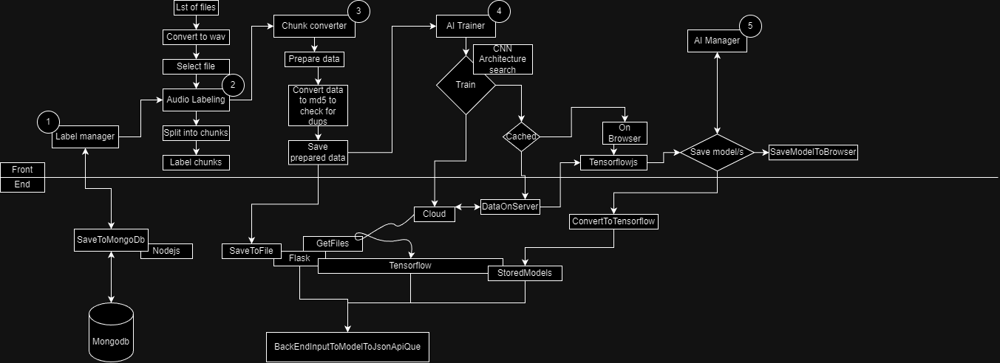

# End-to-End Audio Labeling and AI Training Pipeline

## Overview

This project is an end-to-end solution for labeling audio data, converting audio chunks to spectrograms, and training AI models using the labeled data. The pipeline is designed to handle large amounts of audio data, process it efficiently, and utilize AI for model training and deployment. The solution includes components for data labeling, chunk conversion, AI training, and model management.

## Components

1. **Label Manager**
   - **Purpose:** Allows users to label audio data.
   - **Frontend:** React.js with Chakra UI.
   - **Backend:** Node.js with MongoDB.
   - **Functionality:** Save labeled data to MongoDB.

2. **Audio Labeling**
   - **Purpose:** Split audio files into chunks and label them.
   - **Frontend:** React.js with Chakra UI.
   - **Backend:** Node.js with MongoDB.
   - **Functionality:** Split audio into chunks and save labels.

3. **Chunk Converter**
   - **Purpose:** Convert audio chunks into spectrograms and save the data.
   - **Frontend:** React.js with Chakra UI.
   - **Backend:** Node.js.
   - **Functionality:** Convert audio to spectrograms, generate MD5 hashes for duplicate detection, and save data.

4. **AI Trainer**
   - **Purpose:** Train AI models using labeled spectrogram data.
   - **Backend:** Flask with TensorFlow.
   - **Functionality:** Train CNN models, perform architecture search, and save models.

5. **AI Manager**
   - **Purpose:** Manage and deploy AI models.
   - **Backend:** Node.js.
   - **Functionality:** Load trained models and serve predictions.

## Diagram

