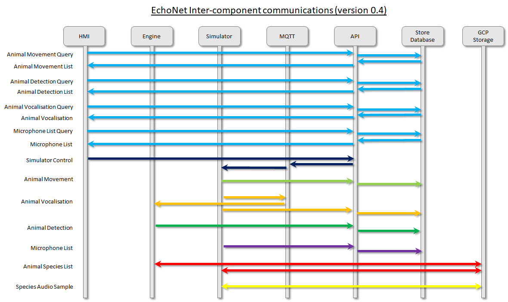

# EchoNet Components Setup

The echo _Components_ directory contains all the core production components of the echo system. These components can be instantiated locally on your developer machine using docker. When the echo components are instantiated in this way, the project echo team call this the **'EchoNet'** environment. Within Docker, a private network is setup called EchoNet and all the component containers join this network.

To define the EchoNet environment, each component has a Docker file which explains how the container is built. Most containers will read in a requirements.txt file to setup the relevant python environment. Since each container is isolated from every other container, each component is free to define its own dependecies (e.g. its own version of python).

There are a couple of containers which are defined by open source community which form part of EchoNet. This includes the MongoDB component and the MQTT-Server component. These provide database endpoints and message queue functionality to facilitate communication between components.

The following diagram is taken from the Echo architecture document located [here](https://deakin365.sharepoint.com/:p:/r/sites/DataBytes2/Shared%20Documents/Project%20Echo/Architecture/Project%20Echo%20Architecture.pptx?d=wd9aa543f681b45f19357c86377de93d5&csf=1&web=1&e=25pLgW).



The diagram describes the flow of information between components at a high level to provide an introduction to how these components interact. For a detailed explaination of the contents of messages please read the associated documentation for each component.

---

## Running EchoNet

### **The following steps will work on either Windows 11 or MacOS. To build the docker components:**

1. Ensure you have setup your development environment using miniconda/Anaconda Navigator.

2. Ensure you have docker desktop installed (https://www.docker.com/products/docker-desktop/).

3. Ensure that docker desktop is running.

4. Ensure there is a trained a model in the following folder: `Project-Echo/src/Components/Engine/models/echo_model/1/`. A new model can be used by running the _optimised_engine_pipeline.ipynb_ notebook.  
   A model is available on the teams site [here](https://deakin365.sharepoint.com/:f:/r/sites/DataBytes2/Shared%20Documents/Project%20Echo/Echo%20Model?csf=1&web=1&e=6feqbC). Extract the .zip and paste the _echo_model_ folder in the following location `Project-Echo/src/Components/Engine/models/`

5. Open your terminal in your miniconda3/Anaconda environment and use the command line to move to the components directory

```
cd Project-Echo\src\Components
```

6. Build and run all the components using the command below. This can take up to 20 mins the first time it is run. Subsequent builds will run much quicker.

```
docker-compose up --build
```

7. All components should start and you should see something like the following running in the Docker Containers:


<br/><br/>

### Authenticating with GCP buckets:

8. The first time you run, in order for the components to work correctly they will need to be authenticated to use GCP buckets so that they can download species data and audio samples. Follow these steps:

- In the containers tab in Docker: click the _ts-echo-engine-cont_ link to open this container.

- Open the logs from the engine and click the provided link.

- Authenticate via the browser using your deakin login, then copy the command in the **top** part of the browser.

- Paste this command into the the _ts-echo-engine-cont_ container terminal and run.

- Click the new link provided by the engine terminal.

- Authenticate via the browser again using your deakin login.

- Copy the key provided in the lower portion of the browser and paste into the engine terminal. Ensure engine initialises correctly by checking the log output.

9. After this has completed restart all containers so they can access the new credentials — the simulator and engine share the credentials via a docker volume. Select all containers and use the refresh button in Docker.

### Restart the build:

10. First, Stop all running containers. Select all containers and press Stop in docker. Alternatively, use the kill command in the running terminal shell (CTRL+ C in Windows; CMD + . in Mac).

11. Delete the Build. In this order:

- Select all containers and Delete.
- Select all images and Delete.
- Then select the volumes **except _echo-net_credentials_volume_** and Delete (Deleting the credentials volume will require step 8 to be repeated).

12. Restart Docker Desktop and from the Components folder in terminal run:

```
docker-compose up --build
```

Follow the terminal to check progress. When complete, you will see frequent messages being sent from the `ts-api-cont` in terminal. Once this has begun, access the HMI.

### Access the HMI:

13. Navigate to http://localhost:8080/ in **Chrome** to view the sim. Refresh 4–5 times to ensure the sim is running correctly, until the microphones are overlaid on the simulated animals.

Everytime the page is refreshed a new sim request is sent.
Toggling the _Simulator_ or _Live Mode_ will also restart the sim.

Once a vocalisaiton has occurred, the grey icon will turn to green or blue. You can then click on this icon to see the species name and the confidence percentage predicted from the engine ML model. Scrolling down, the _Location Confidence_ percentage will display the accuracy of the predicted location, based on the microphone arrays.

---

# **Common Troubleshooting Tips**

## `Simulator timeout:`

It is possible that the Simulator may timeout after around 10 mins. The messages sent in terminal will stop.

### **Fix:**

If this occurs, and _tf-simulator-cont_ container has exited, click to restart it.

---

## `Failed to solve credentials:`

The config file needs to be changed. This can be a recurring issue.

The below error can occur if the docker config file has changed:

```
failed to solve: error getting credentials - err: docker-credential-desktop resolves to executable in current directory (./docker-credential-desktop), out: ``
```

### **Fix:**

Run the following terminal command to open the config file:

```
open  ~/.docker/config.json
```

Check that config file looks something like below.

```
{
    "CredsStore": "",
    "stackOrchestrator: "swarm"
}
```

Commonly, this requires deleting `"auths" :{},` if present.  
Also ensure that `"CredsStore": "",` is blank.

---

## `Cannot connect to the Docker:`

The below error may occur when trying to build the containers:

```
Cannot connect to the Docker daemon at unix:///var/run/docker.sock. Is the docker daemon running?
```

### **Fix:**

Ensure all containers have been deleted. If not, follow steps 10 and 11 above.  
Follow step 12 to Quit and Restart Docker Desktop.
