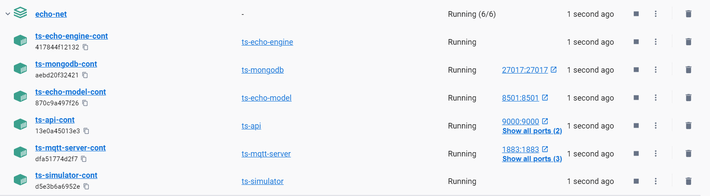

### Echo Components

The echo Component directory contains all the core production components of the echo system.  These components can be instantiated locally on your developer machine using docker.  When the echo component are instantiated in this way, the project echo team call this the 'EchoNet' environment.  Within Docker, a private network is setup called EchoNet and all the component containers join this network.

To define the EchoNet environment, each component has a Docker file which explains how the container is built.  Most containers will read in a requirements.txt file to setup the relevant python environment.  Since each container is isolated from every other container, each component is free to define its own dependecies (e.g. its own version of python).

There are a couple of containers which are defined by open source community which form part of EchoNet.  This includes the MongoDB component and the MQTT-Server component.  These provide database endpoints and message queue functionality to facilitate communication between components.

The following diagram is taken from the Echo architecture document located here: https://deakin365.sharepoint.com/:p:/r/sites/DataBytes2/Shared%20Documents/Project%20Echo/Architecture/Project%20Echo%20Architecture.pptx?d=wd9aa543f681b45f19357c86377de93d5&csf=1&web=1&e=25pLgW


The diagram describes the flow of information between components at a high level to provide an introduction to how these component interact.  For a detailed explaination of the contents of messages please read the associated documentation for each component.

### Running EchoNet

To build the docker components and run on windows 11:

1. Ensure you have setup your development environment using miniconda

2. Ensure you have docker desktop installed (https://www.docker.com/products/docker-desktop/)

3. Ensure that docker desktop is running

4. Open your miniconda3 command line and move to the components directory

```
cd Project-Echo\src\Components
```

5. Build and run all the components

```
docker-compose up --build
```

6. All components should start are you should see something like the following running all the components (note this snapshot was taken before HMI was integrated so it is missing):



7. The first time you run:  In order for the components to work correctly they will need to be authenticated to use GCP buckets so that they can download species data and audio samples.  To do this you need to login to once of the containers using docker attach and provide your key.  Open the logs from the engine and click the provided link, authenticate via the browser, then paste your key onto the container terminal.

8. Get the container id

```
docker ps
```

9. Attach and paste key

```
docker attach <container_id_or_name>
```

10. Paste key and ensure engine initialises correctly by checking the log output

11. Restart all containers so they can access the new credentials - the simulator and engine share the credentials via a docker volume

