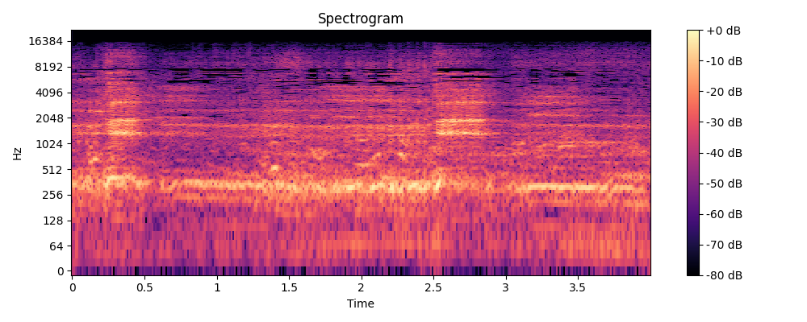

# Engine - Source additional animal audio data for training

## Overview 
This database contains cleaned audio recordings of various Australian species such as the Koala, Southern Cassowary, Tasmanian Devil and Gouldian Finch. This data is classified into folders with the common names of these species.
The audio files are scraped from Youtube using Youtube-video-to-audio scraping code and then event segmentation (Event Segmenter) was performed on each of the audio files to identify event(audio) and saved in a folder post whcih the data was cleaned and stored for future training purpose. 

## Details of the Data Bucket
- **Total Size**: 127 MB
- **Number of files**: 414 Files 
- **Directory Structure**: The audio files are stored in 'Additional Species.zip' folder, which contains 4 subfolders like 'Koala', 'Southern Cassowary', 'Tasmanian Devil' and 'Gouldian Finch'.

## Importance 
These audio files are of crucial importance to project Echo, when training models related to emdangered species.

## Sources 
These sounds were downloaded from below list:
Gouldian Finch:
https://www.youtube.com/watch?v=XA3UZle8M0k
https://www.youtube.com/watch?v=kG7W7c5bT-Q
https://www.youtube.com/watch?v=iulZTGW5VL0

Koala:
https://www.youtube.com/watch?v=f0fYTHrFN7c
https://www.youtube.com/watch?v=fq74aS4irmc
https://www.youtube.com/watch?v=kfc1qk1SIjE
https://www.youtube.com/watch?v=ua9XICf9ylU
https://www.youtube.com/watch?v=jmeBQVQIsTU
https://www.youtube.com/watch?v=re6GenuOqLw

Southern Cassowray:
https://www.youtube.com/watch?v=4dcQO6Zb8Eg
https://www.youtube.com/watch?v=7QxIv62-rq8
https://www.youtube.com/watch?v=sloCWGAVLtM
https://www.youtube.com/shorts/k6rqoZG7Yk0
https://www.youtube.com/shorts/qOFPO5v-E7I
https://www.youtube.com/watch?v=EoP3qXOOkAo
https://www.youtube.com/watch?v=SbQQmMJMac0

Tasmanian Devil:
https://www.youtube.com/watch?v=pW27vpK4ALQ
https://www.youtube.com/watch?v=v2AU7AtY-js
https://www.youtube.com/watch?v=e-ApreQq9XI
https://www.youtube.com/watch?v=7PSI1DEZ8AQ
https://www.youtube.com/watch?v=oQPLUWxKPsw
https://www.youtube.com/watch?v=gygvuLnHoN8
https://www.youtube.com/watch?v=xJoU3rkV6MY
https://www.youtube.com/watch?v=gg56hjw9z8M

## Sample Audio Details 

| File Name          | Audio Samples |
|--------------------|---------------|
| Gouldian Finch     |    196        |
| Koala              |     75        |
| Southern Cassowary |     65        |
| Tasmanian Devil    |     78        |

## Play the Sample audio files 

https://drive.google.com/file/d/1U0c4Czz9WoCuN3XZAQHR0cOtP_oI6E0_/view?usp=sharing

Access this link to play and download the sample audios.

## Sample Spectograms

 
 
 
