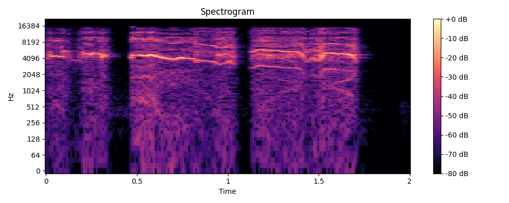
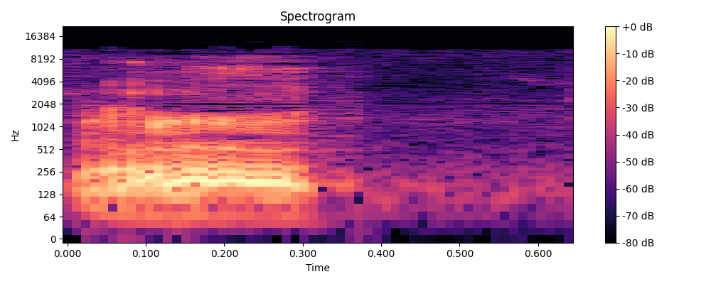
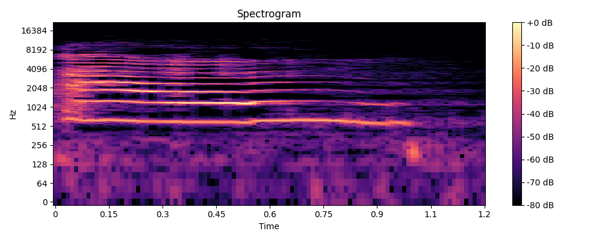
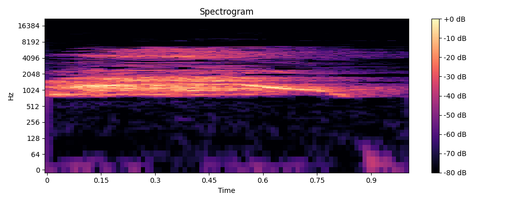

# Engine - Data collection of pest species

## Overview 
This database contains cleaned audio recordings of various Australian species such as the Foxes, Boar, Cane Toads, Rat and Cat. This data is classified into folders with the common names of these species.
The audio files are scraped from Youtube using Youtube-video-to-audio scraping code and then event segmentation (Event Segmenter) was performed on each of the audio files to identify event(audio) and saved in a folder post whcih the data was cleaned and stored for future training purpose. 

# Youtube_Video_to_Audio scraper used:
https://github.com/DataBytes-Organisation/Project-Echo/blob/main/src/Prototypes/data/scraping/Youtube%20video%20to%20audio%20(.wav%20format)/README.md

## Details of the Data Bucket
- **Total Size**: 76 MB
- **Number of files**: 322 Files 
- **Directory Structure**: The audio files are stored in 'Pest Species.zip' folder, which contains 4 subfolders like 'Foxes', 'Boar', 'Cane Toads, 'Rat' and 'Cat'.

## Importance 
These audio files are of crucial importance to project Echo, when training models related to endangered species.

## Sources 
These sounds were downloaded from below list:

Foxes:
https://www.youtube.com/watch?v=g6v2tpJ24d4

Boar:
https://www.youtube.com/watch?v=3Dbziwli7h4

Cane Toads:
https://www.youtube.com/watch?v=2BAKkyxXA1w
https://www.youtube.com/watch?v=ICHySUG4Yzw

Rat:
https://www.youtube.com/watch?v=PbBptW7DmPQ

Cat:
https://www.youtube.com/watch?v=J3Bkd_XFJzY

## Sample Audio Details 

| File Name             | Audio Samples |
|-----------------------|---------------|
| Foxes                 |     99        |
| Boar                  |    116        |
| Cane Toads            |     15        |
| Rat                   |     30        |
| Cat                   |     82        |

## Play the Sample audio files 

https://drive.google.com/file/d/14CLOJRW6pTF2MMSn2r_BcbGETBAlVAaQ/view?usp=sharing

Access this link to play and download the sample audios.

## Sample Spectograms

 
 
 
 

