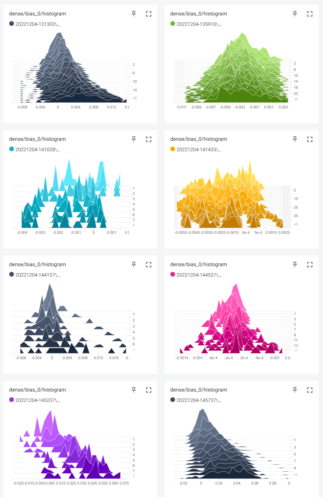
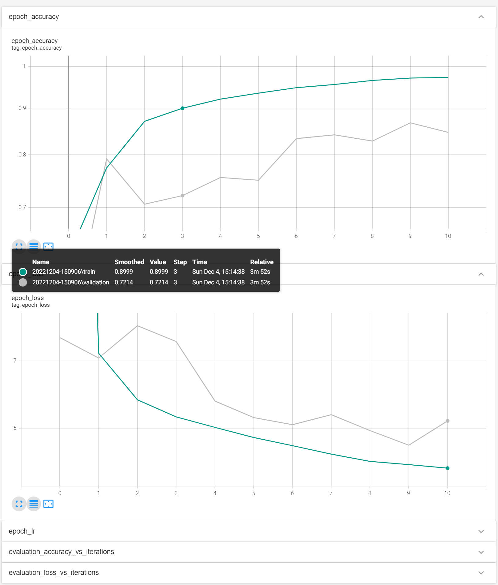

# Model Baselines

This baseline prototype models includes two types of models

> CNN model using pre-trained image classifiers (see [baseline_cnn.ipynb]())

> HTS-AT SOTA model used without pre-trained weights (see [baseline_htsat.ipynb]())

## A benchmark classification using HTS-AT model

This baseline is an attempt to integrate and adapt code from the original author's source code from: https://github.com/retrocirce/hts-audio-transformer

 

## The original author of this model
Ke Chen
knutchen@ucsd.edu
HTS-AT: A HIERARCHICAL TOKEN-SEMANTIC AUDIO TRANSFORMER FOR SOUND CLASSIFICATION AND DETECTION
The configuration for training the model will be adapted as required for this experiment.

## Approach for Project Echo

The idea is the benchmark the classification performance against our project Echo audio dataset using an algorithm with known good performance in audio classification tasks.

The HTS-AT algorithm is one of the top performing algorithms on the baseline ESC-50 audio dataset as shown here: https://paperswithcode.com/sota/audio-classification-on-esc-50

The code in this folder is an adaptation of the original author's code with the eventual aim to leverage pre-computed melspectrograms rather than calculating them inline (which the original code does).

The original code was implemented in pytorch and leverages the pytorch lightening framework.  This approach will be continued for this benchmark investigation.  If proved to be successful the project may move to re-writing this code for tensorflow (the preferred framework for Project Echo)

## Monitoring training of the CNN model

The baseline CNN model is integrated with tensorboard.  To monitor the training in real time run the following from miniconda command line:

> open miniconda command prompt (Windows -> Start -> Anaconda Prompt (miniconda))

> conda activate dev

> cd Project-Echo/src/baseline/

> tensorboard --logdir=./tensorboard_logs

Then go to your favourite web browser and open up the tensorboard display via http://localhost:6006/  

Example screenshots from training the cnn model:

 

 

