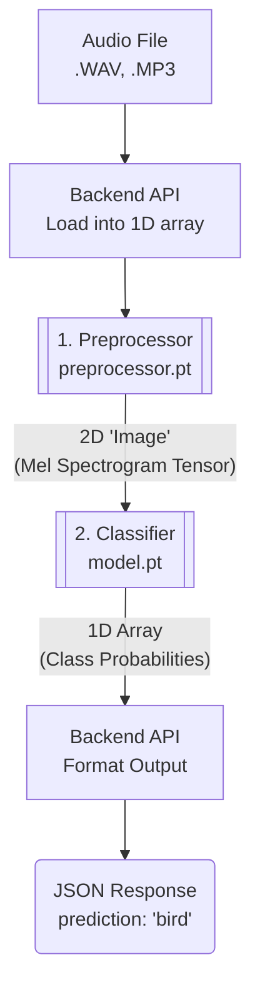

# Model Integration Guide for Backend Engineering

This guide outlines the integration of the audio classification model. The primary concept to understand is the model's input method, which differs from some traditional machine learning approaches.

A traditional model might expect pre-calculated features as separate arguments:
`predict_sound(duration=5.0, avg_loudness=-20.5, ...)`

This deep learning model, however, operates on the raw data directly:
`predict_sound(audio_data)`

It accepts a single argument: a multi-dimensional array (tensor) representing the audio data. The model learns the relevant features from this data intrinsically, which is a core advantage of the deep learning methodology. This is analogous to an image recognition API, which processes an entire image file rather than a set of pre-calculated attributes.

---

## The Two-Step Inference Pipeline

For backend integration, the process is best understood as a two-step pipeline involving two distinct models, which are called in sequence.

1.  **The Preprocessor (`preprocessor.pt`)**
2.  **The Classifier (`model.pt`)**

The data flow is as follows:
```
[Audio File] -> [Your Backend API]
(e.g., WAV, MP3)        |
                        v
           (Load into a 1D array of numbers)
                        |
                        v
        +-----------------------------------+
        |  1. Preprocessor (`preprocessor.pt`) |
        +-----------------------------------+
                        |
                        v
(2D "Image" of the sound: a Mel Spectrogram Tensor)
                        |
                        v
        +-----------------------------------+
        |   2. Classifier (`model.pt`)      |
        +-----------------------------------+
                        |
                        v
 (1D Array of class probabilities: e.g., [0.1, 0.8, 0.05, ...])
                        |
                        v
            [Your Backend API] -> [JSON Response]
         (e.g., {"prediction": "bird"})
```



### Step 1: The Preprocessor (`preprocessor.pt`)

This model is a deterministic data converter. Its function is to transform a raw audio waveform into a format the main classifier model can analyse.

-   **Input**: A 1D array (tensor) of floating-point numbers representing the audio waveform.
-   **Output**: A 2D array (tensor) representing a **Mel Spectrogram**.
-   **Implementation Note**: Your code will load an audio file into memory to get the raw waveform data and pass that single array to this model.

> For a detailed explanation of how a waveform is converted to a Mel Spectrogram, please see the [**Preprocessing Details**](preprocessing_details.md).

### Step 2: The Classifier (`model.pt`)

This is the main classification model, a CNN trained to find and recognise patterns in the spectrogram "images" generated by the preprocessor.

-   **Input**: The 2D spectrogram tensor from the preprocessor.
-   **Output**: A 1D array of floating-point numbers, where each value is the probability for a specific sound class. These probabilities sum to 1.0.
-   **Implementation Note**: The output from the preprocessor is passed directly as the single argument to this model.

## Example Backend API Flow

> [!NOTE]
> **Planned for Sprint 2:** This part is not finished yet.

The following pseudo-code illustrates a typical implementation within a backend endpoint:

```python
# Load the two models once when your application starts
preprocessor_model = load_torch_model("preprocessor.pt")
classifier_model = load_torch_model("model.pt")

# Define the API endpoint
def handle_audio_classification_request(audio_file):
    # 1. Load the uploaded audio file into a raw waveform array
    waveform_array = load_audio_file(audio_file)

    # 2. Call the preprocessor model with the waveform
    spectrogram_tensor = preprocessor_model.run(waveform_array)

    # 3. Call the classifier model with the spectrogram
    probability_array = classifier_model.run(spectrogram_tensor)

    # 4. Interpret the results (business logic)
    highest_prob_index = find_index_of_max_value(probability_array)
    class_name = lookup_class_name(highest_prob_index) # e.g., index 1 -> "dog_bark"
    confidence = probability_array[highest_prob_index]

    # 5. Return a clean JSON response
    return {
        "prediction": class_name,
        "confidence": confidence
    }
```

## Summary for Integration

-   The backend's responsibility is to orchestrate calls to the two models (`preprocessor.pt` and `model.pt`) in sequence.
-   Each model function accepts a single argument.
-   The output of the preprocessor is the input for the classifier.
-   Multiple arguments are not required because the complex features are learned intrinsically by the network from the spectrogram data.

---
## Classifier Model Details

The classifier model is responsible for analysing the preprocessed spectrogram and making a prediction. This project supports several powerful architectures and advanced training techniques to improve accuracy.

-   For details on the different model architectures available (e.g., EfficientNetV2, PANNs), please see the [**Model Architectures Guide**](architectures.md).

-   To understand how we improve the model's ability to distinguish between classes, please see the guide on [**Metric Learning**](metric_learning.md).

---
## Project Data and Training

The information above is primarily for integrating and using the pre-trained models. If you are interested in the data used for training or wish to re-train the model yourself, the following guide provides the necessary details.

-   For instructions on accessing the dataset and setting up your environment for data download, please see the [**Dataset and Setup Guide**](dataset_and_setup.md).
