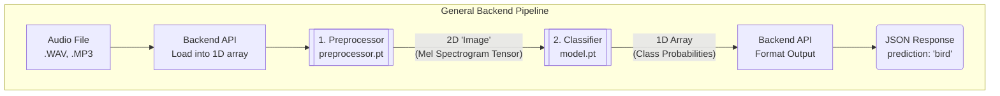
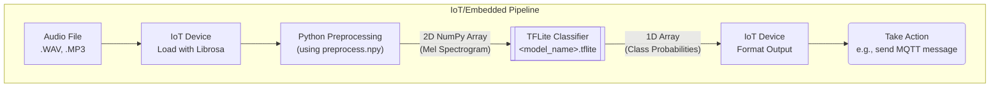

# Model Integration Guide

This guide outlines the integration of the audio classification model for different backend environments. The model operates on raw audio data, learning features intrinsically rather than requiring pre-calculated inputs.

This project supports two primary deployment pipelines:
1.  **General Backend:** For servers with PyTorch installed, using a two-step TorchScript pipeline (`preprocessor.pt` and `model.pt`).
2.  **IoT/Embedded (`torch`-free):** For resource-constrained devices like a Raspberry Pi, using a lightweight TFLite model (`.tflite`) and a pure Python/NumPy preprocessing function.

---

## A. General Backend (PyTorch Environment)

This process involves two distinct TorchScript models that are called in sequence. It is the recommended approach for server environments where PyTorch is available.

1.  **The Preprocessor (`preprocessor.pt`)**
2.  **The Classifier (`model.pt`)**



### Step 1: The Preprocessor (`preprocessor.pt`)

This model transforms a raw audio waveform into a Mel Spectrogram.

-   **Input**: A 1D PyTorch tensor representing the audio waveform.
-   **Output**: A 2D PyTorch tensor representing a **Mel Spectrogram**.

### Step 2: The Classifier (`model.pt`)

This is the main classification model (a CNN).

-   **Input**: The 2D spectrogram tensor from the preprocessor.
-   **Output**: A 1D array of class probabilities.

### Example API Flow (PyTorch Backend)

```python
# Load the two models once when your application starts
preprocessor_model = load_torch_model("preprocessor.pt")
classifier_model = load_torch_model("model.pt")

# Define the API endpoint
def handle_audio_classification_request(audio_file):
    # 1. Load the uploaded audio file into a raw waveform tensor
    waveform_tensor = load_audio_file_as_tensor(audio_file)

    # 2. Call the preprocessor model with the waveform
    spectrogram_tensor = preprocessor_model.run(waveform_tensor)

    # 3. Call the classifier model with the spectrogram
    # This example assumes the classifier model includes thresholding
    prediction_index_tensor, probability_tensor = classifier_model.run(spectrogram_tensor, threshold=0.5)

    # 4. Interpret the results (business logic)
    prediction_index = prediction_index_tensor.item()
    if prediction_index == -1:
        class_name = "unknown"
        confidence = find_max_value(probability_tensor)
    else:
        class_name = lookup_class_name(prediction_index)
        confidence = probability_tensor[0][prediction_index].item()

    # 5. Return a clean JSON response
    return { "prediction": class_name, "confidence": confidence }
```

---

## B. IoT/Embedded (`torch`-free)

This pipeline is designed for devices where PyTorch is not available, such as a Raspberry Pi. It uses a TFLite model and a pure Python/NumPy preprocessing function that relies on `librosa` and `scipy`.

The required assets are:
1.  **Preprocessing Data (`preprocess.npy`)**
2.  **TFLite Classifier (`<model_name>.tflite`)**



### Step 1: Preprocessing (Python Function)

Instead of a model file, the preprocessing is a Python function that must be included in your project. This function depends on a single data file, `preprocess.npy`.

-   **Asset: `preprocess.npy`**: This is a NumPy file containing a dictionary of all necessary data for preprocessing:
    -   Configuration values (sample rate, n_fft, etc.).
    -   The exact Mel filter bank matrix used during model training.
-   **Input**: A 1D NumPy array representing the audio waveform.
-   **Output**: A 2D NumPy array representing a **Mel Spectrogram**.

### Step 2: TFLite Classifier (`<model_name>.tflite`)

This is the lightweight, optimized classification model.

-   **Input**: The 2D spectrogram array from the Python preprocessing function.
-   **Output**: A 1D array of class probabilities.

### Example API Flow (IoT Device)

```python
# On device startup, load assets
tflite_interpreter = load_tflite_interpreter("model.tflite")
preprocess_data = load_numpy_file("preprocess.npy") # This is a dictionary
class_names = load_class_names("class_names.txt")

# The preprocessing function that runs on the device
def preprocess_with_librosa(waveform_array, pp_data):
    # This function contains the librosa/numpy logic to convert
    # a waveform into a spectrogram, using the parameters and
    # filter bank from the pp_data dictionary.
    #
    # Example implementations of this function can be found in:
    # - `demo_iot.py`
    # - `validate_models.py`
    # - `validating_audio_file.py`
    ...
    return spectrogram_array

# Main processing loop
def process_audio_chunk(audio_chunk_waveform):
    # 1. Preprocess the audio chunk
    spectrogram = preprocess_with_librosa(audio_chunk_waveform, preprocess_data)

    # 2. Run TFLite inference
    tflite_interpreter.set_tensor(input_details['index'], spectrogram)
    tflite_interpreter.invoke()
    probabilities = tflite_interpreter.get_tensor(output_details['index'])[0]

    # 3. Interpret and act on the result
    confidence = np.max(probabilities)
    prediction_index = np.argmax(probabilities)
    class_name = class_names[prediction_index]

    if confidence > 0.7:
        print(f"Event detected: {class_name} ({confidence:.2f})")
        # send_mqtt_alert(class_name, confidence)
```

## Summary for Integration

-   **For general backends:** Use the two-step TorchScript pipeline (`preprocessor.pt` -> `model.pt`).
-   **For IoT/Embedded devices:** Use the TFLite model (`.tflite`) combined with the Python preprocessing function and the `preprocess.npy` data file.
-   The `deploy_model.py` script generates all necessary artifacts for both pipelines from a single trained model.

---

## Validation and Example Implementations

To see these pipelines in action, this project includes several utility scripts for validation and demonstration. These scripts serve as practical examples of how to integrate and use the exported model artifacts.

-   `demo_iot.py`: A command-line tool for batch-processing audio files using the TFLite pipeline.
-   `validate_models.py`: A script to verify the consistency and accuracy between the PyTorch and TFLite pipelines.
-   `validating_audio_file.py`: A Gradio web UI for interactively testing audio files with either model.

For detailed instructions on how to use these tools, please see the [**Validation and Demonstration Tools Guide**](tools_and_validation.md).

---
## Project Details

-   For details on model architectures: [**Model Architectures Guide**](architectures.md).
-   To understand metric learning: [**Metric Learning**](metric_learning.md).
-   For information on training data: [**Dataset and Setup Guide**](dataset_and_setup.md).
-   For guides on included tools: [**Validation and Demonstration Tools Guide**](tools_and_validation.md).
